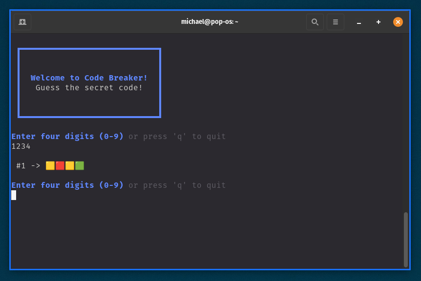
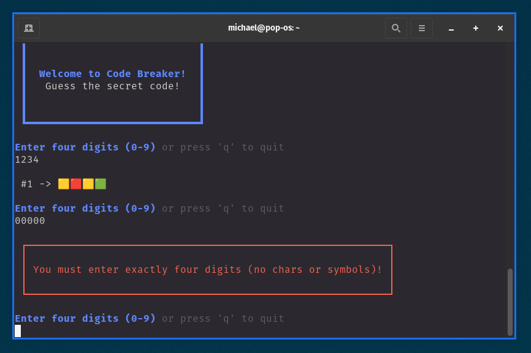
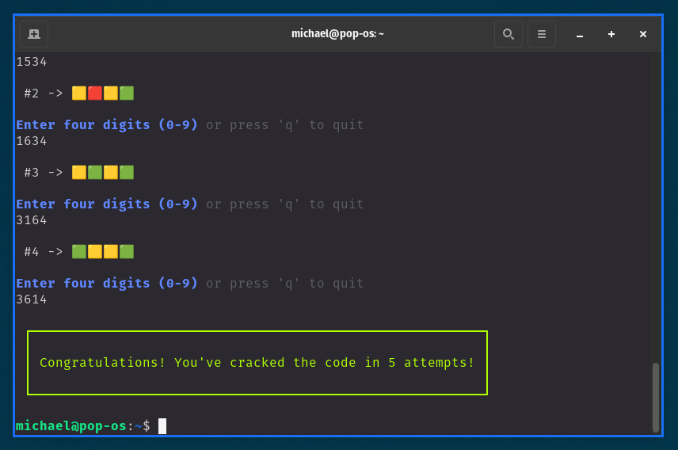
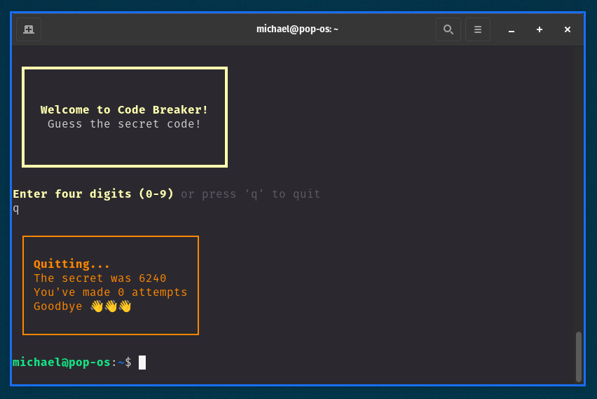

# Code Breaker Game

Code Breaker is a CLI Game inspired by Wordle and Mastermind. The rule is simple find out the secret code with the help of the clues.

The clues:

- 🟩: the number is good and at the right place.

- 🟨: the number is good but not at the right place.

- 🟥: this number is not in the secret code.

## Screenshot









## Installation 

```
curl -o install.sh https://raw.githubusercontent.com/m1kc3b/code-breaker/master/install.sh
chmod +x install.sh
./install.sh
```